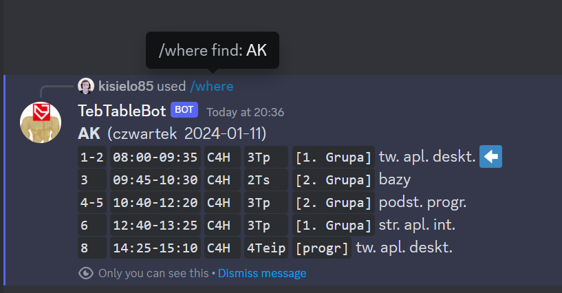
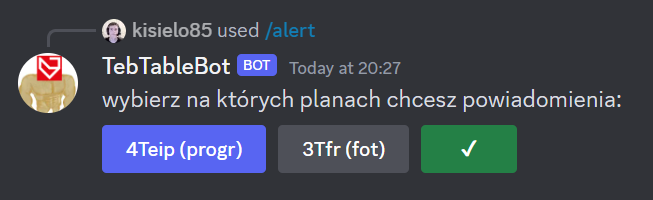
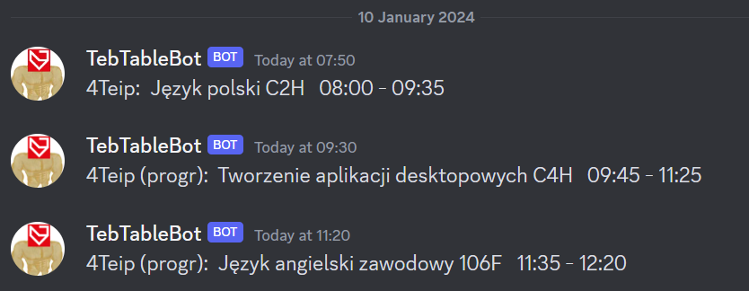

# TebTable bot

discord bot połączony z planem lekcji dla Liceum i Technikum Teb Edukacja we Wrocławiu 
made by: [**kisielo85**](https://github.com/kisielo85) (Przemek B.) & [**Le-programer**](https://github.com/Le-programer) (Marcel M.)

aby użyć bota możesz wejść na nasz serwer, i korzystać z niego poprzez prywatne wiadomości 
https://discord.gg/HYazSHbkHk

lub zaproś go na swój serwer 
https://discord.com/api/oauth2/authorize?client_id=1163559297280639056&permissions=0&scope=bot

## Komendy

### /where

sprawdź gdzie teraz ma lekcje dana klasa/nauczyciel, lub kto jest w danej sali 

### /lekcje

zapisz interesujący cię plan lekcji 
zapisane plany będą potrzebne do reszty komend z tej listy

### /alert

włącz lub wyłącz powiadomienia 

5min przed końcem lekcji, bot napisze ci gdzie będzie następna 

### /plan

wygeneruj png planu lekcji 
możesz wybrać jeden z wcześniej zapisanych planów, lub użyć argumentu aby wyszukać inny

przykład: 
/plan `plan:c14` 
/plan `plan:4teip`

### /joinedplan

połącz 2 plany w jeden png
